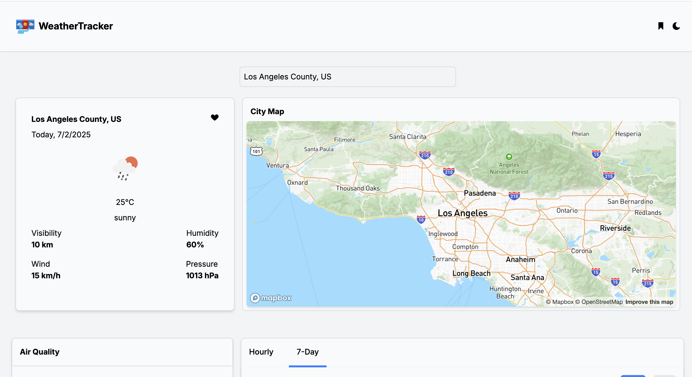
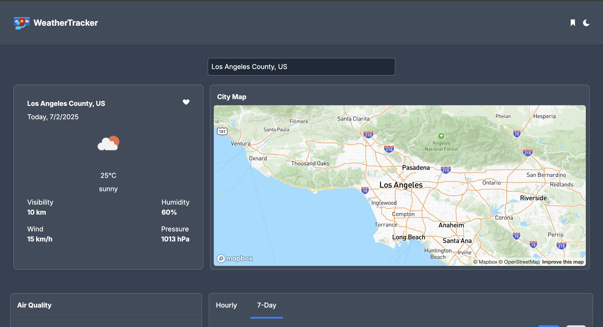

# 🌦️ WeatherTracker

A sleek and responsive weather dashboard built with **React**, **React Router**, **Tailwind CSS**, **Chart.js**, and data from **GeoDB** and **OpenWeather APIs**. Search for any city and get up-to-date hourly and 7-day forecasts, including map visualizations, temperature charts, and more — with full support for dark mode.

---

## 🔍 Features

- 🔎 **City Search Autocomplete** (powered by GeoDB API)
- 📍 **Live Weather Data** (OpenWeather One Call API 3.0)
- 🧭 **Location-based Forecasts** (lat/lon from GeoDB)
- 🌡️ **Hourly & 7-Day Forecast Charts** (Chart.js line/bar toggle)
- 🗺️ **City Map Preview**
- 🌫️ **Air Quality Section**
- 🌗 **Dark Mode Support**
- 💾 **Global Context for Selected City** (no localStorage)

---

## 📸 Screenshots

> Light Mode  
> 

> Dark Mode  
> 

---

## 🧠 Tech Stack

- **Framework**: React + React Router
- **Styling**: Tailwind CSS
- **Charts**: Chart.js
- **API Services**:
  - [GeoDB Cities API](https://rapidapi.com/wirefreethought/api/geodb-cities)
  - [OpenWeather One Call API](https://openweathermap.org/api/one-call-3)

---

## ⚙️ Getting Started

### 1. Clone the repo

```bash
git clone https://github.com/Mayowa-Dimeji/weather-tracker.git
cd weather-tracker
```

### 2. Install dependencies

```bash
npm install
```

### 3. Set up your `.env`

Create a `.env` file and add your API keys:

```env
VITE_GEODB_API_KEY=your_geodb_api_key
VITE_OPENWEATHER_KEY=your_openweather_api_key
```

### 4. Run the app

```bash
npm run dev
```

---

## 📁 Project Structure

```
/app
  ├─ /context           # City context (selected city state)
  ├─ /pages             # Page components (search, forecast, map, air-quality)
  ├─ /routes            # App routing setup
  ├─ /assets            # Image & chart assets
  └─ App.tsx            # Main app entry
```

---

## ✨ Future Improvements

- ✅ Add favorites or history
- 🌍 Add multi-language / unit conversion
- 📲 Make PWA installable
- ⚠️ Add error boundaries and offline fallback

---

## 🧑‍💻 Author

Made with ❤️ by **Mayowa Oladimeji**  
[Portfolio](https://my-portfolio-gamma-bay-50.vercel.app/) • [GitHub](https://github.com/Mayowa-Dimeji/weather-tracker.git) •
